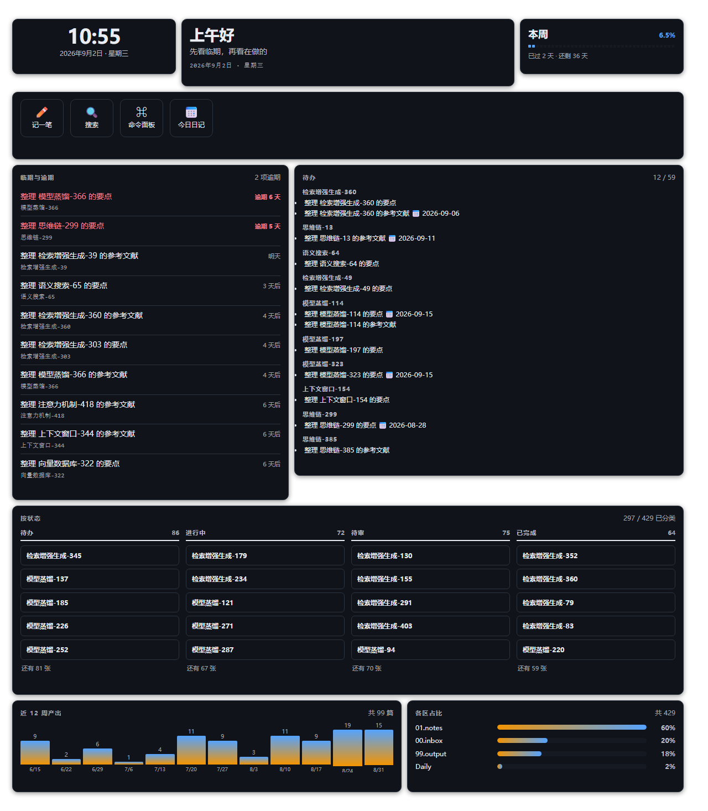
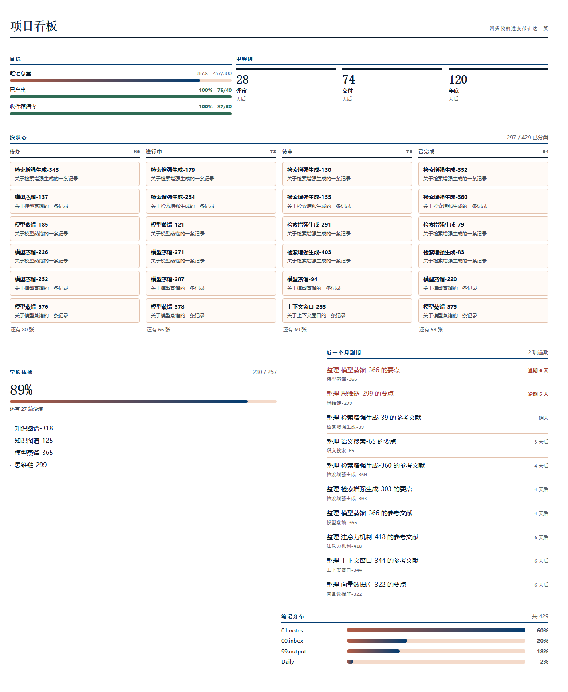
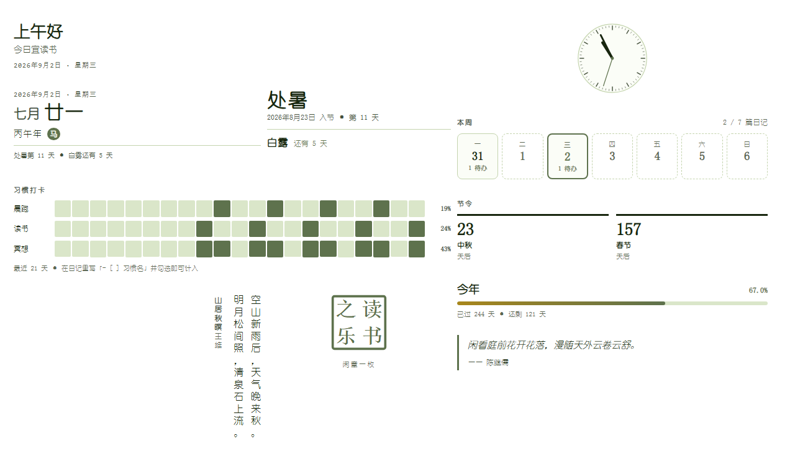
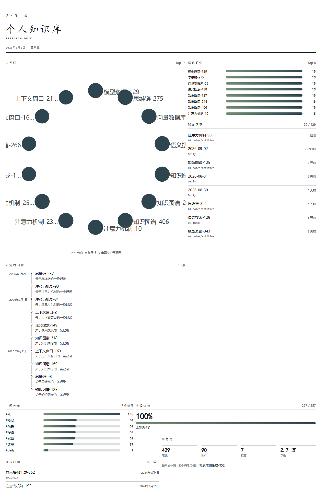
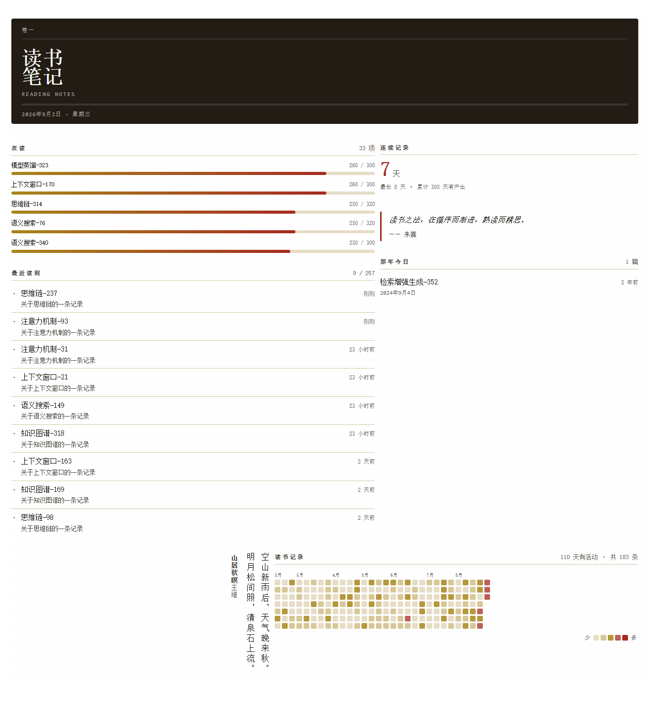
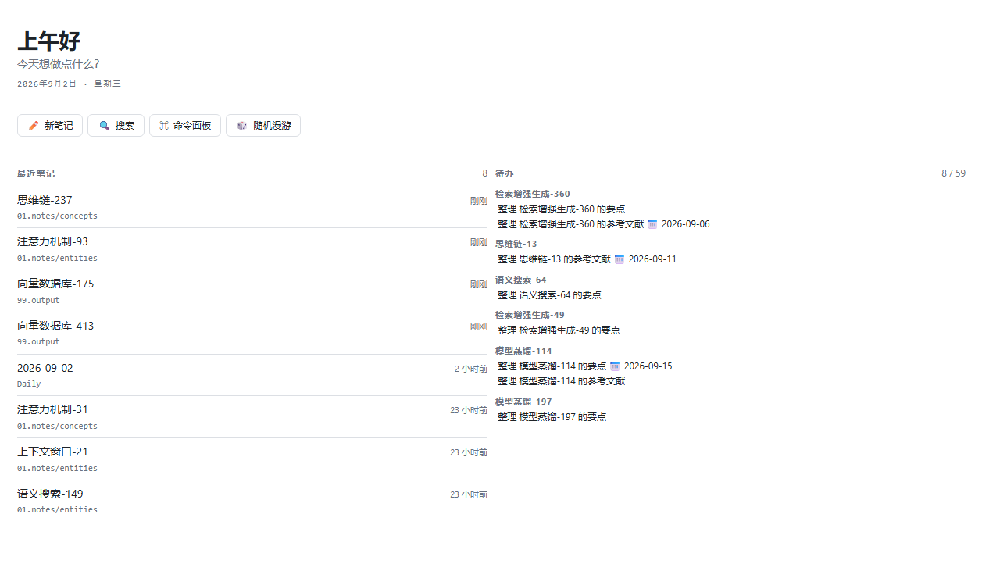
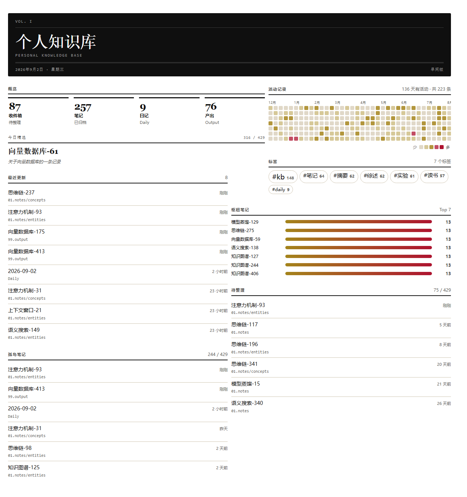
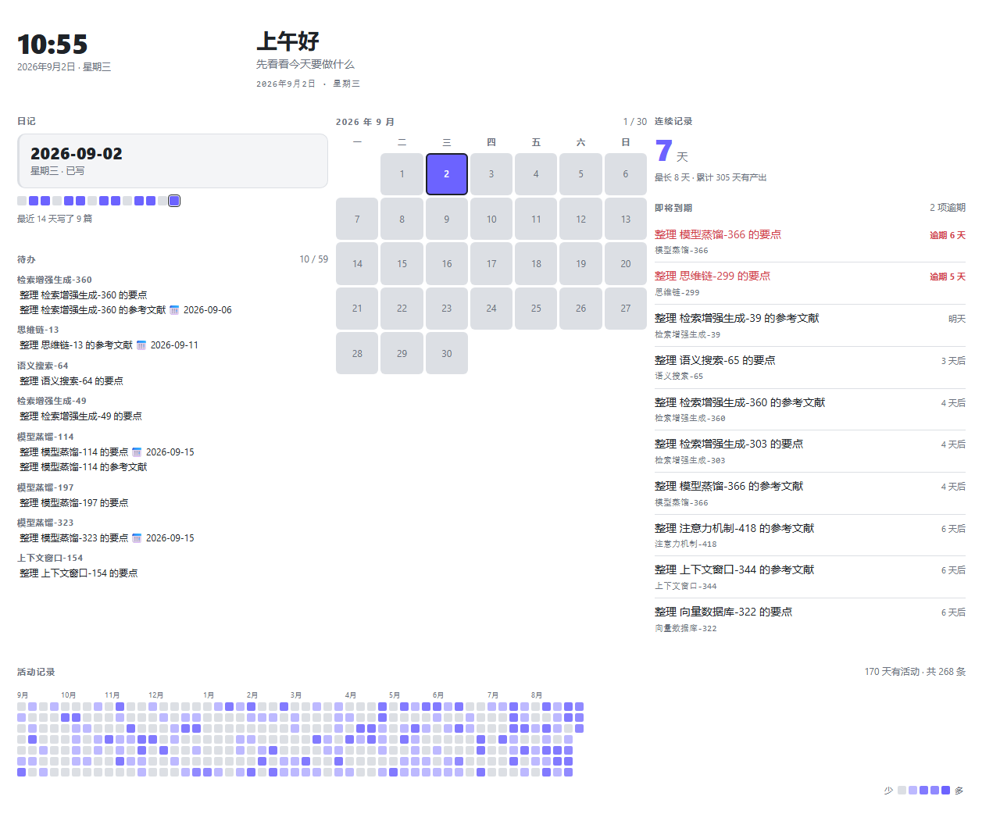
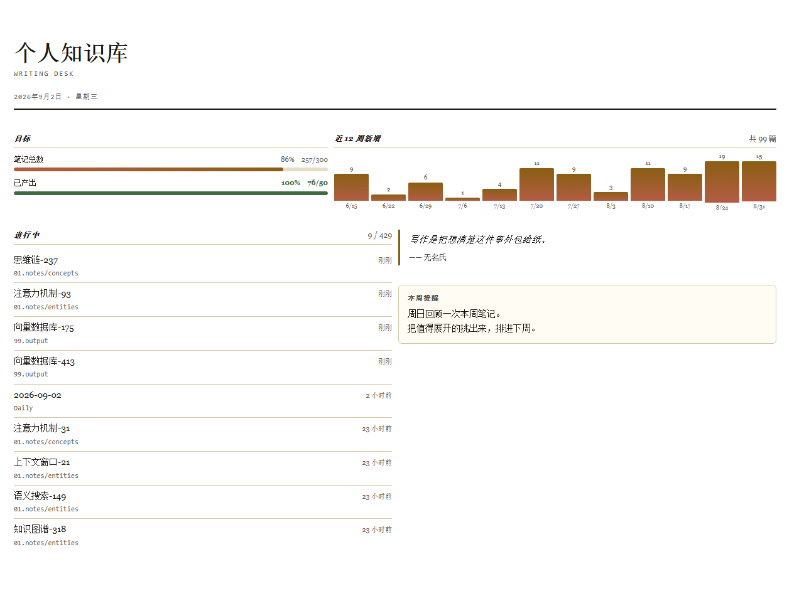

# Obsidian Workbench Kit

中文 · [English](README.en.md)

一套 Obsidian 首页组件库。把 `_wb/` 文件夹丢进你的库，新建一篇笔记，就能拼出自己的首页工作台 —— 不用写 CSS，不用装 CSS 片段。

> 状态：**v0.5.0**。可视化看板、**51 个组件（7 大分类）**、**12 套中式主题**、**9 套开箱模板**。
> 两种安装方式：**插件版**（推荐，不依赖任何其他插件）或 **dataviewjs 版**（不装插件，直接放文件夹）。



<sub>「工作台」模板 · 曜石主题。以下截图均由 `node scripts/shoot.mjs` 从真实组件渲染导出，数据来自脚本生成的测试库。</sub>

---

## 它解决什么问题

Obsidian 社区里漂亮的首页方案很多，但它们几乎都是**一次性艺术品**：文件夹路径硬编码在 dataviewjs 里，样式和数据逻辑揉在一起，换个库就得从头重写。

这套组件库把三件事拆开：

| | 谁负责 | 你怎么改 |
|---|---|---|
| **数据来源** | `config.json` 里的路径别名 | 改 4 行路径映射 |
| **渲染逻辑** | `components/` 里的组件 | 不用动 |
| **视觉主题** | `themes/` 里的 CSS 变量 | 改 1 个字段 |

组件里永远写 `@inbox`，不写 `00.raw`。所以同一份组件能直接在任何库里跑。

---

## 安装

两条路，装哪个都行。**同一套内核、同样 51 个组件、同样 12 套主题**，页面长得一模一样。

### A. 插件版（推荐）

**不依赖任何其他插件。**

先拿到构建好的插件包 —— 二选一：

- 从 [Releases](https://github.com/jialingxiao/Obsidian-Workbench-Kit/releases) 下载 `main.js` 和 `manifest.json`；
- 或者克隆仓库后自己构建（不需要 npm，也不需要装任何依赖）：

  ```bash
  node scripts/build-plugin.mjs
  ```

  产物在 `dist/plugin/`。`dist/` 不进仓库，所以直接克隆是没有这个目录的。

然后：

1. 把 `dist/plugin/` 整个复制成 `你的库/.obsidian/plugins/workbench-kit/`
2. 在 Obsidian 的第三方插件里启用 **Workbench Kit**
3. 点侧边栏的 ⊞ 图标 —— 没有工作台笔记就自动建一篇
4. 在插件设置里把**路径别名**指向你库里真实的文件夹

页面里的写法：

````markdown
```workbench
```
````

### B. dataviewjs 版

**前置**：[Dataview](https://github.com/blacksmithgu/obsidian-dataview) 插件，并在其设置里打开 **JavaScript Queries**。

1. 把 `vault/_wb/` 整个文件夹复制到你的库根目录（结果是 `你的库/_wb/`）
2. 打开 `_wb/config.json`，把 `paths` 改成你库里真实的文件夹：

   ```json
   "paths": {
     "inbox":  "00.收件箱",
     "notes":  "01.笔记",
     "daily":  "日记",
     "output": "99.输出"
   }
   ```

3. 把 `examples/工作台.md` 复制进库，打开它

页面里的写法：

````markdown
```dataviewjs
await dv.view("_wb")
```
````

---

两种方式都**不需要安装 CSS 片段** —— 样式由运行时自动注入。

| | 插件版 | dataviewjs 版 |
|---|---|---|
| 依赖 | 无 | Dataview（需开 JS） |
| 配置 | 插件设置界面 | `_wb/config.json` |
| 布局存在哪 | 插件数据目录 | `_wb/boards/` |
| 库里多出文件 | 不多 | `_wb/` 文件夹 |
| 改组件源码 | 要重新构建 | 直接改，立即生效 |

想改组件、写自己的组件，用 dataviewjs 版更顺手；只是想用，装插件版。

---

## 用法

### 看板模式（推荐）

整篇首页只需要这一行：

````markdown
```dataviewjs
await dv.view("_wb")
```
````

打开后右上角有工具栏：

| 按钮 | 作用 |
|---|---|
| **✏️ 编辑** | 进入编辑态。**默认是关的** —— 首页天天要点里面的链接，随手一拖就改了布局会很烦 |
| **＋ 组件** | 挑组件加进来，自动找空位落座，并按内容量自动定高 |
| **⚡ 模板** | 一键铺好一整套现成布局 |
| **↩ 撤销** | 退回上一步（最多 20 步），删错组件不用重搭 |
| **🎨 主题** | 一键把所有组件切换成另一套配色 |

编辑态下：拖标题条移动，拖右下角缩放，⚙ 改参数（表单由组件自己的参数定义自动生成），✕ 删除。退出编辑态后框线全部消失，看起来就是一张排好版的首页。

布局存在 `_wb/boards/<笔记名>.json`。**每篇笔记有各自独立的布局**，所以你可以建好几个不同用途的工作台。

### 单组件模式

也可以把某个组件单独嵌进任何一篇笔记：

````markdown
```dataviewjs
await dv.view("_wb", { c: "heatmap", source: "@inbox", weeks: 52 })
```
````

首页笔记的 frontmatter 建议这样写：

```yaml
---
cssclasses: [wb-page]      # 通栏 + 隐藏标题栏，只在首页加
obsidianUIMode: preview    # 阅读模式，拖拽手感最稳
---
```

---

## 组件目录（51 个 · 7 类）

「＋ 组件」面板按下面的分类分组，并支持搜索。

### 页头

| `c` | 名称 | 说明 |
|---|---|---|
| `masthead` | 报头 | 刊号 / 大标题 / 头像 / 日期与刊次 |
| `clock` | 时钟 | 会走的大时钟与日期 |
| `greeting` | 问候语 | 按钟点变化的问候，带副标题 |
| `quote` | 每日一句 | 句子可来自参数，或库里一篇摘抄笔记 |
| `banner` | 横幅 | 大图 + 压字标题 |

### 导航入口

| `c` | 名称 | 说明 |
|---|---|---|
| `quick-actions` | 快捷入口 | 打开笔记 / 新建 / 执行命令 / 开网址 |
| `bookmarks` | 收藏 | **直接读 Obsidian 自带书签**，零配置 |
| `folders` | 文件夹导航 | 文件夹 + 笔记数，点击直达 |
| `tags` | 标签 | 标签云或排行，点击跳全库搜索 |
| `search` | 搜索框 | 首页直接开搜，可预置范围与常用查询 |

### 数据统计

| `c` | 名称 | 说明 |
|---|---|---|
| `stats` | 指标卡组 | 一排大数字，可按路径自动统计 |
| `heatmap` | 活动热力图 | 按天统计的周网格 |
| `breakdown` | 分类占比 | 按子文件夹自动拆分的横条 |
| `trend` | 增长趋势 | 按周/月新增笔记的柱状图 |
| `vault-info` | 库总览 | 笔记数、附件、标签、最早的一篇 |
| `goals` | 目标进度 | 一组「已完成 / 目标」进度条 |
| `coverage` | 字段体检 | 某字段的填写率 + 还没填的那几篇 |
| `attachments` | 附件体检 | 最占地方的附件，或已经没人引用的 |
| `graph` | 关系图 | 引用最多的笔记摆成一圈，画出彼此的链接 |

### 笔记流

| `c` | 名称 | 说明 |
|---|---|---|
| `recent` | 最近笔记 | 按时间排序，带相对时间 |
| `notes` | 笔记列表 | 万能款：自选范围、排序、过滤 |
| `spotlight` | 今日精选 | 每天推一篇，或随机漫游 |
| `orphans` | 孤岛笔记 | 没有任何反链的笔记 |
| `hubs` | 枢纽笔记 | 被引用最多的笔记 |
| `untagged` | 待整理 | 缺标签 / 缺字段 / 内容过短 |
| `table` | 表格 | **自选字段当列的通用表格**，最万能的一块 |
| `timeline` | 时间线 | 按日期排成竖轴，同一天归组 |
| `stale` | 久未回顾 | 很久没动过的笔记 |
| `on-this-day` | 那年今日 | 往年今天写下的笔记 |
| `opened` | 最近打开 | 按实际打开顺序（≠ 最近修改） |
| `reading` | 在读进度 | 带进度字段的笔记 + 进度条 |

### 任务与计划

| `c` | 名称 | 说明 |
|---|---|---|
| `tasks` | 待办 | 汇总全库待办，**可直接勾选**（回写原笔记） |
| `daily` | 日记入口 | 直达今天的日记，没有就创建 |
| `calendar` | 月历 | 整月格子，写过的日期点亮可点开 |
| `upcoming` | 即将到期 | 带 📅 的待办按时间排，逾期标红 |
| `streak` | 连续记录 | 连续多少天有产出，含历史最长 |
| `kanban` | 分列看板 | 按 frontmatter 字段（或文件夹）分列 |
| `week` | 本周 | 七天一排，日记状态 + 当天待办数 |
| `habit` | 习惯打卡 | 习惯 × 日期网格，数据来自日记里的 checkbox |
| `countdown` | 倒计时 | 距某天还有／已过多少天，可每年重复 |

### 版面元素

| `c` | 名称 | 说明 |
|---|---|---|
| `heading` | 分区标题 | 给看板分段 |
| `divider` | 分隔线 | 细线 / 双线 / 虚线 / 纯留白 |
| `text` | 文本块 | 直接在看板上写一段话 |
| `embed` | 嵌入笔记 | 把某篇笔记或它的某个小节渲染进来 |

### 装饰

首页全是数据和列表会很干。这些不只是好看 —— 它们是让那 12 套中式主题真正成立的部分。

| `c` | 名称 | 说明 |
|---|---|---|
| `seal` | 印章 | 朱红闲章，可刻自定义字。颜色跟着主题走，不写死 |
| `poem` | 诗词 | 竖排右起，配宣纸 / 水墨最对味 |
| `solar-term` | 节气 | 当前节气 + 距下一个几天 |
| `lunar` | 农历 | 农历日期、干支生肖，可带节气与春节倒数 |
| `year-progress` | 时间进度 | 「2026 已过去 65%」，可切年/季/月/周 |
| `analog-clock` | 表盘 | SVG 指针钟 |
| `image` | 图片 / 图集 | 单图配说明，或一个文件夹的图墙 |

> **关于历法**：节气和农历都在 `core/astro.js` 里用天文算法算（Meeus），**不联网也不查表**。
> 之所以不用常见的「查表法」：那要写两百个十六进制常数，错了很难发现，而农历算错会安静地显示在首页上没人察觉。
> 天文法每一步都能验证 —— `node scripts/verify-lunar.mjs` 拿 **11 个春节日期、3 个闰月位置、7 个农历节日、168 个节气** 对过，全部通过。
> 那个脚本加载的是真正发布出去的 `core/astro.js`，不是副本。

**完整参数见 [docs/components.md](docs/components.md)** —— 那份文档由 `scripts/gen-docs.mjs` 从各组件的 `meta.props` 自动生成。同一份定义驱动运行时默认值、⚙ 设置表单和文档，不写第二遍，也就不会漂移。

---

## 主题（12 套）

### 设计思路

主题不是「换个配色」，而是一组**受约束的 token**。整套体系立在三条规则上：

**1. 组件永远不写死颜色和字体。** 全部走 `--wb-*` 变量。这是换主题能生效的唯一前提 —— 一旦有组件写了 `#C41E3A`，那套主题就在它身上失效了。

**2. 字体从共用字体池里挑，不各写各的。** `core/base.css` 里定义了 `--wb-f-song / -kai / -hei / -yuan / -fangsong / -serif / -mono`，每条都按 macOS → Windows → 思源/Noto → 通用 的顺序排好兜底。**一律只用系统已装的字体，不联网拉字体** —— 组件库要能离线用，也不该把阅读体验绑在 CDN 上。

**3. 每套主题必须过对比度门槛**，不是「看着还行」就发布。而且**深色底的门槛比浅色底高约 1.5 倍**：

WCAG 2 的对比度公式在深色底上系统性高估可读性 —— 同样 4.6:1，浅底上的灰字清清楚楚，深底上的灰字发糊。这不是我的猜测，WCAG 3 草案里的 APCA 算法就是为解决这件事提出的。我没有自己实现 APCA（凭记忆写一套感知模型，错了比不做更糟），而是给深色底加一个经验倍率。

| 用途 | token | 浅底门槛 / 实测最低 | 深底门槛 / 实测最低 |
|---|---|---|---|
| 正文 | `--wb-text` | ≥ 7（AAA） / **13.85** | ≥ 13 / **15.05** |
| 次要文字 | `--wb-muted` | ≥ 4.5（AA） / **7.33** | ≥ 9 / **9.93** |
| 弱化小字 | `--wb-faint` | ≥ 4.5 / **5.18** | ≥ 7 / **7.75** |
| 强调色对底 | `--wb-accent` | ≥ 3 / **4.60** | ≥ 4.5 / **5.14** |
| 强调色上的字 | `--wb-on-accent` | ≥ 4.5 / **5.44** | ≥ 4.5 / **5.12** |
| 报头小字 | `--wb-mast-dim` | 报头底一律深色，按深底算 | ≥ 7 / **7.00** |
| 边框看不看得见 | `--wb-border` | ≥ 1.2 / **1.37** | ≥ 1.35 / **1.56** |

12 套主题 + 7 套深色覆写 = 19 个变体，每个变体的每种文字对**它真正会压在的每一种底色**（页底 / 卡片底 / 次级底 / 强调色块 / 报头底）都查一遍，全部通过。上一版只查了页面底，藏了 11 处问题。

表里的实测值不是手抄的，`scripts/audit-contrast.mjs` 会直接打出来。

**3b. 分层有两条路，走通一条就行。** 卡片要么比页底亮（浅色主题），要么有看得见的边框（深色主题）。深底上硬提卡片明度会把「正文 / 卡片底」的对比度压下去，所以深色主题一律是边框 + 投影分层 —— 这是取舍，不是遗漏。

**4. 主题自我描述，不另立清单。** 名字、说明、字体标注、三色样本写在各自 CSS 的头部注释里（`@name / @desc / @font / @swatch`），丢一个 `.css` 进 `themes/` 就自动出现在菜单里。

**5. 配色集中生成。** 12 套手写必然漂移（这套改了那套忘了），所以由 `scripts/gen-themes.py` 统一生成 —— 改配色策略时一处改、十二份齐。脚本里我只定「色相和气质」，明度由它推到对比度达标为止。

**6. 强调色是成对的，两个色相。** 每套主题有 `--wb-accent` 和 `--wb-accent-2`，条形图、柱状图、热力图都画成两色渐变。早先的第二强调色是主色调亮一档 —— 同一个色相的深浅，画成渐变几乎看不出变化，这正是配色显得「单薄」的来源。现在的配对取自中国传统色的两两组合（茶色×藕荷、铭金×竹子青、鱼师青×青梅、天青×鹅黄、绀宇×十样锦……），色相差最小 26°、最大 176°。

唯一的例外是素笺：它只能拿到用户 Obsidian 的强调色，而 Obsidian 的 accent 家族全是同一色相的深浅。硬塞一个色相进去就不叫「跟随你的主题」了 —— 那套的单色渐变是故意的。

### 主题一览

完整参考：**[docs/themes.md](docs/themes.md)**

| id | 名称 | 气质 | 字体 |
|---|---|---|---|
| `sujian` | **素笺** | 中性默认，完全跟随你的 Obsidian 主题与明暗模式 | 系统界面字体 |
| `xuanzhi` | **宣纸** | 米白纸面，墨黑字，朱砂点题，带极淡纸纹 | 宋体 |
| `shuimo` | **水墨** | 冷灰纸上浓淡两级墨色，留白多过着墨 | 楷体标题 + 黑体正文 |
| `zhusha` | **朱砂** | 黑红杂志排版，粗标题配朱红，最有个性 | 衬线（Playfair / 宋体） |
| `qingci` | **青瓷** | 青白釉色打底，鱼师青配青梅，大圆角 | 宋体 |
| `qiuhao` | **秋毫** | 奶油纸配金褐与茶色，像摊开的手稿本 | Georgia 衬线 |
| `zhuying` | **竹影** | 浅豆青配竹子青，铭金点缀，清爽轻快 | 圆体 |
| `ganyu` | **绀宇** | 十样锦的暖粉纸压绀青深蓝，冷暖对冲 | 黑体正文 + 宋体标题 |
| `songyan` | **松烟** | 深墨底配金褐，深色里少见的宋体 | 宋体（深色） |
| `dianlan` | **靛蓝** | 深靛底配月白字，天青与鹅黄点题 | 黑体（深色） |
| `yaoshi` | **曜石** | 近黑底配电光蓝与萱草黄，仪表盘观感 | 黑体（深色） |
| `chenlv` | **沉绿** | 沉绿夜底上一点绿茶色，最有精神的深色 | 圆体（深色） |

前 8 套是浅色设计并带深色模式覆写（跟随 Obsidian 明暗切换）；后 4 套**认定深色**，浅色模式下打开也照样是深色 —— 这是刻意的。

绀宇是唯一一套「有颜色的浅底」：其余浅色主题的底不是白纸就是米黄，它用的是十样锦那种暖粉。

楷体只用在标题：长段正文用楷体在屏幕上很难读。

### 换主题的三种方式

主题名**中文名、拼音 id、英文名三者等价**，写哪个都认。

```jsonc
// 1. 全库统一：_wb/config.json
{ "theme": "宣纸" }        // 或 "xuanzhi" / "Xuan Paper"
```

```yaml
# 2. 单页覆盖：笔记 frontmatter
wbTheme: 松烟
```

3. 看板工具栏「🎨 主题」一键切换（会存进该看板的布局文件）

### 微调配色

不想改主题文件，只想动一两个颜色：

```jsonc
// _wb/config.json —— 内联注入，压过主题里的类选择器
{ "tokens": { "accent": "#8B5CF6", "radius": "2px" } }
```

---

## 开箱模板

空看板会直接摆出模板卡片，点一下铺好整页；工具栏「⚡ 模板」也能随时调用（会替换现有布局，需二次确认，且**可撤销**）。

9 套模板，每套换一种主题，组件和参数也各不相同 —— 不是同一批组件换个配色。

| 模板 | 内容 | 默认主题 |
|---|---|---|
| **极简起步** | 问候 + 快捷入口 + 最近笔记 + 待办，四块起步 | 不指定 |
| **工作台** | 临期与逾期 + 待办 + 按状态分列 + 产出趋势 | 曜石 |
| **项目管理** | 目标 + 里程碑倒计时 + 状态看板 + 明细表 + 字段体检 | 绀宇 |
| **日程计划** | 时钟 + 日记 + 月历 + 到期待办，以「今天」为中心 | 素笺 |
| **写作台** | 目标 + 产出趋势 + 进行中的稿子 | 秋毫 |
| **研究台** | 关系图 + 枢纽与孤岛 + 时间线 + 久未回顾 | 水墨 |
| **知识库** | 报头 + 概览 + 精选 / 标签 / 枢纽 / 孤岛 | 朱砂 |
| **阅读台** | 在读进度 + 摘抄 + 那年今日 + 竖排诗词 | 宣纸 |
| **生活雅集** | 农历 + 节气 + 习惯打卡 + 印章 + 诗词，最不像仪表盘的一套 | 竹影 |


### 长什么样

<table>
<tr>
<td width="50%"><b>项目管理</b> · 绀宇<br></td>
<td width="50%"><b>生活雅集</b> · 竹影<br></td>
</tr>
<tr>
<td><b>研究台</b> · 水墨<br></td>
<td><b>阅读台</b> · 宣纸<br></td>
</tr>
</table>

<details>
<summary>其余四套：极简起步 · 知识库 · 日程计划 · 写作台</summary>

<br>

**极简起步**（不指定主题，跟随你的 Obsidian）



**知识库** · 朱砂



**日程计划** · 素笺



**写作台** · 秋毫



</details>

完整参考：**[docs/presets.md](docs/presets.md)**。模板是 `_wb/presets/*.json`，格式和看板布局文件一样，自己加一个就会出现在列表里。套用时会先按实际内容定高、再跑一遍布局算法压紧，所以手写坐标和高度都不必精确。坐标写在 **24 列**的栅格上（`_wb/core/board.js` 里的 `DEFAULT_BOARD`）。

`node scripts/verify-presets.mjs` 校验模板：组件 id 存在、参数名在 `meta.props` 里声明过、布局不越界不重叠、主题名能解析。手写 JSON 里拼错一个字母不会报错，只会安静地渲染成一张空卡片。

### 拖拽手感

栅格是 **24 列 · 行高 12px**。这个颗粒度直接决定拖拽精度 —— 一步最小能挪多少像素：800px 宽的看板上水平步进 34px、垂直 22px（12 列 / 行高 34 的旧栅格是 68px / 44px）。旧看板会自动迁移（`version: 1 → 2`，坐标 ×2），迁移前后**渲染像素完全一致**，变的只是能停在多细的位置上。

拖动和缩放采用**延迟让位**：过程中其他块一个都不动，落点由虚框提示，松手才整理并带过渡动画。实时让位看着热闹，但画面一直在动反而看不清自己要落到哪；更要紧的是，拖拽代码和布局代码同时在写同一批元素，「谁把谁改回去」那类竞态就是从那里来的。

**出图**：`dev/shots.html` 把每套模板按自己的主题渲染成一张固定宽度的图（`?p=<id>` 单张、`?plain=1` 去掉页面外壳），`node scripts/shoot.mjs` 用无头 Chrome/Edge 批量导出 2 倍图到 `dist/shots/`（发社媒用，不进仓库）；README 里这批 1 倍图是 `WB_SHOT_OUT=docs/shots WB_SHOT_SCALE=1 node scripts/shoot.mjs` 出的。需要先起静态服务器（`python -m http.server 8123`）。不依赖 puppeteer。

---

## 路线图

- [x] **M0** 运行时内核 + 组件契约 + 主题系统
- [x] **M1** 可视化看板（拖拽 / 缩放 / 加删组件 / 参数表单 / 主题切换 / 布局持久化）+ 51 个分类组件
- [x] **M2** 12 套主题（含对比度审计）+ 9 套开箱模板 + 撤销
- [x] **M3** 参考文档（源码生成）、英文 README、release 打包
- [x] **M4** 封装成 Obsidian 插件：` ```workbench ` 代码块 + 侧边栏图标 + 设置界面，**不依赖 Dataview**

更新记录见 [CHANGELOG.md](CHANGELOG.md)。

---

## 开发

浏览器里预览组件，不用开 Obsidian：

```bash
python -m http.server 8123
```

然后访问 `http://localhost:8123/dev/preview.html`。它用桩件模拟 `dv` / `app` 和一批假笔记，跑的是**真正的调度器**，所以验证的是真实行为。页面分四段：

| 区块 | 用途 |
|---|---|
| **看板模式** | 可交互的真看板：加组件、拖拽、缩放、套模板、换主题、撤销 |
| **字体自检** | 各字体族在**本机**实际落到哪一个（逐像素检测，不是猜） |
| **主题墙** | 12 套主题同屏对照，顶栏可切明/暗 |
| **单组件模式** | 51 个组件 × 2 套主题并排，含故意触发的错误边界 |

另有 `dev/plugin-test.html`：把构建产物当成真插件加载（桩掉 `require('obsidian')` 后真的调 `onload()` 和代码块处理器），22 项断言覆盖引导、渲染、模板、持久化、设置界面。

**「模拟 Obsidian 样式」保持开着。** 它按真实加载顺序注入 Obsidian 对 `button` / `input` / `ul` 的全局规则。Obsidian 给 `button` 设了固定高度，任何按钮里塞了多行块级内容的组件都会被它压坏 —— 这类 bug 不模拟就只能等真机暴露。

改组件时把 `config.json` 的 `dev` 设为 `true`，可跳过缓存边改边看。改完 `_wb/` 里的代码后，把笔记关掉重开即可 —— 内核版本号变了会自动失效缓存；版本号没变的话需要重启 Obsidian。

> Obsidian 和浏览器同为 Chromium，**字体可用性完全一致** —— 字体自检在浏览器里看到什么，Obsidian 里就是什么。

### 生成脚本

```bash
python scripts/gen-themes.py      # 12 套主题 CSS
node   scripts/gen-docs.mjs       # docs/{components,themes,presets}.md
node   scripts/make-testvault.mjs # 244 篇假笔记的测试库
node   scripts/build-release.mjs  # dist/*.zip（dataviewjs 版发布包）
node   scripts/build-plugin.mjs   # dist/plugin/（插件版，单文件，不用 npm）
```

> Windows 上 Node 无法从含非 ASCII 字符的路径启动脚本（报 exit 9）。所有脚本都支持 `WB_ROOT` 环境变量：把脚本复制到 ASCII 路径下运行，用 `WB_ROOT` 指回仓库位置。读写中文路径本身没问题，只有进程启动受影响。

### 写一个组件

`components/<id>/component.js` 必须是**单个表达式** —— 一个 `(WB) => {...}` 工厂函数，外面不能再有别的语句（文件会被 `return (...)` 包裹）。私有辅助函数写在工厂函数体内。

```js
(WB) => ({
  meta: {
    id: "hello",
    group: "layout",                       // 决定它出现在面板的哪一组
    name: { zh: "示例", en: "Hello" },
    desc: { zh: "一句话说明", en: "One-line description" },
    props: { who: { type: "text", default: "世界", desc: "称呼谁" } },
    layout: { w: 4, h: 3 },                // 加进看板时的默认格子数
    demo: { who: "Obsidian" },             // 画廊/预览用的示例参数
  },
  render({ el, h, props, ui, q, link }) {
    el.appendChild(h("div.wb-hello", { text: `你好，${props.who}` }));
  },
})
```

放进 `components/hello/` 就会**自动出现在面板里** —— 没有需要同步的清单文件。

- `group` 取值：`header` / `nav` / `metrics` / `notes` / `tasks` / `layout`
- 同目录放 `style.css` 会被自动注入
- 颜色一律用 `--wb-*` 变量，**不要写死** —— 那是换主题能生效的前提
- 列表、条形图、柱状图、胶囊这些常见版式用 `ui.noteList()` / `ui.bars()` / `ui.columns()` / `ui.chips()`，长相才和其他组件一致
- 数据一律走 `q.*`（`q.pages` / `q.count` / `q.tasks` / `q.tallyByDay`），不要直接调 Dataview —— 将来换数据源时只改一个文件

---

## License

MIT
